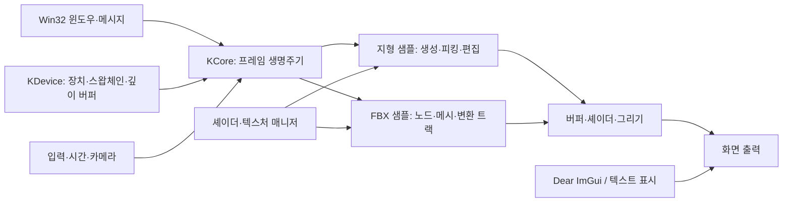

# Direct3D · Graphics & Engine Programming Portfolio

**Direct3D 11로 구성한 게임 그래픽스와 엔진 기반 구조의 설계**

윈도우와 그래픽 장치 초기화부터 프레임 갱신, 리소스 관리, 지형 편집, FBX 모델 표현까지 연결한 그래픽스 학습 프로젝트입니다. 이 저장소는 주요 설계 사례를 **문제 → 설계 선택 → 책임과 동작 흐름 → 한계와 검증** 순서로 소개합니다.

`C++` · `Direct3D 11` · `Win32` · `HLSL` · `Resource Management` · `Terrain Picking` · `FBX SDK` · `Dear ImGui`

> **읽기용 기술 포트폴리오입니다.** 구조·설계 설명과 다이어그램만 제공합니다. 소스 코드, 코드 발췌, 실행 파일, 외부 라이브러리와 모델은 포함하지 않습니다.

## 프로젝트 개요

| 항목 | 내용 |
|---|---|
| 분야 | 게임 그래픽스 및 엔진 프로그래밍 |
| 공통 기반 | KCoreLib의 윈도우·장치·루프·입력·카메라·리소스 관리 |
| 응용 영역 | 지형 생성·피킹·정점 편집, FBX 모델 및 노드 애니메이션 |
| 구성 성격 | 공통 프레임워크를 활용하는 여러 샘플 프로젝트 |

## 프로젝트의 설계 전제

- Windows와 Direct3D 11을 기반으로 하며 장치·컨텍스트·스왑체인의 역할을 직접 다룹니다.
- 공통 프레임워크는 초기화·갱신·렌더·종료 순서를 제공하고 샘플은 각 단계의 작업을 구성합니다.
- CPU에서 구성한 메시·변환·조명 데이터를 버퍼와 셰이더를 통해 화면에 전달합니다.
- 리소스 매니저는 이미 읽은 항목을 찾아 재사용하고 종료 시 관리 대상을 해제합니다.
- 지형 샘플과 FBX 샘플은 별도 응용입니다. 
- 외부 SDK와 도구의 기능을 활용합니다.

## 구조 한눈에 보기

이 그림은 공통 프레임워크와 응용 샘플의 관계를 나타냅니다. 구성 요소별 책임은 [전체 구조](docs/01-architecture.md)에서 설명합니다.

## 공개 범위와 제작 경계

렌더링 파이프라인과 엔진 기반 책임을 이해하고 연결한 학습 프로젝트로 소개합니다.

[원본 프로젝트](https://github.com/Hato-1998/3DProgamming) · [검토 기준과 공개 범위](NOTICE.md)

---

**English overview:** A documentation-only portfolio of a Direct3D 11 learning framework and samples. It explains the application/render loop, resource reuse, terrain picking and editing, and FBX mesh/node-animation processing. No source code or assets are included.
