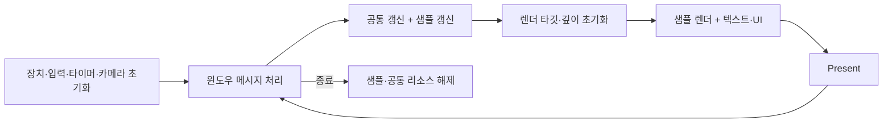

# 과제 01 · 실행 루프와 리소스의 수명

[← 개요](../README.md)

## 문제

각 샘플이 윈도우·그래픽 장치·입력·출력을 따로 구현하면 같은 기반 작업이 반복됩니다. 텍스처와 셰이더를 사용할 때마다 다시 생성하는 것도 관리와 해제를 복잡하게 만듭니다.

## 설계 선택

KDevice는 장치·스왑체인과 렌더 타깃·깊이 버퍼를 구성합니다. KCore는 공통 프레임 순서를 갖고, 응용별 작업을 그 안에서 호출합니다. 매니저는 이름 기반 검색으로 기존 리소스를 반환하고 없을 때 로드해 보관합니다.

## 리소스 재사용

공통 매니저는 키로 기존 객체를 찾고 이미 있으면 재사용합니다. 로드 실패 시 새 객체를 정리하며, 종료 시 관리 목록의 자원을 해제합니다. 공통 검색·보관 패턴을 템플릿으로 표현합니다.

현재 기본 키는 전체 경로가 아닌 파일명과 확장자를 중심으로 만들어집니다. 서로 다른 폴더에 같은 이름의 파일이 있으면 구분 문제가 생길 수 있습니다. 경로 정규화나 리소스 ID 도입은 이런 제약에 대응하는 확장 방향이지 현재 달성한 기능은 아닙니다.

## 한계와 검증 관점

장치 생성 실패의 전파, 창 크기 변경 후 렌더 타깃과 카메라 설정, 반복 로드·해제, 동일 파일명 충돌을 확인해야 합니다. raw pointer와 명시적 해제가 사용되는 경로가 있으므로 소유자와 해제 시점을 추적해야 합니다. 자동 수명 관리가 모든 경로에 적용됐다고 설명하지 않습니다.
