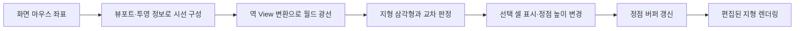

# 과제 02 · 마우스 위치에서 지형 편집까지

[← 개요](../README.md)

## 문제

마우스는 화면의 2차원 좌표를 주지만, 편집할 지형은 월드의 삼각형 메시입니다. 사용자가 가리킨 지형을 찾고, 수정된 정점이 실제 화면에 반영되도록 좌표계와 데이터 전달을 연결해야 합니다.

## 메시 구성

지형은 행·열 격자의 정점과 셀을 나눈 삼각형 인덱스로 표현합니다. 면 법선과 정점에 인접한 면 정보를 이용해 정점 법선을 계산하는 경로가 있습니다. 월드 위치의 높이 조회는 셀 안의 어느 삼각형에 속하는지에 따라 보간합니다.

## 피킹과 편집 흐름

샘플은 지형의 삼각형을 순회해 교차를 검사하고, 선택된 셀의 색과 높이를 조정합니다. 평탄화와 높이 변경 분기를 제공하며 수정 결과를 GPU 정점 버퍼로 전달합니다.

## 선택의 효과와 대가

| 선택 | 장점 | 대가 |
|---|---|---|
| 규칙적인 격자 | 셀·정점·삼각형 대응이 단순 | 큰 지형일수록 정점과 교차 검사 증가 |
| 삼각형 직접 교차 | 선택 판정의 수학과 흐름이 명확 | 공간 가속 구조 없이 순회 비용 발생 |
| CPU 정점 편집 후 버퍼 갱신 | 데이터 수정과 결과의 관계를 직접 확인 | 변경 범위와 업로드 빈도 관리 필요 |

## 한계와 검증 관점

현재 선택은 순회 중 처음 교차한 셀에서 멈춥니다. 카메라에 가장 가까운 교점을 항상 선택하는 방식과 같다고 볼 수 없습니다. 지형이 접히거나 겹치면 별도 확인이 필요합니다.

지형 편집 후 법선 갱신, 버퍼 업로드 횟수, 경계 셀의 높이 조회, 창 크기와 카메라 변화에 따른 광선 계산이 주요 검증 항목입니다. 법선 생성 기능이 존재하는 것과 모든 편집 직후 자동 갱신되는 것은 구분합니다.
