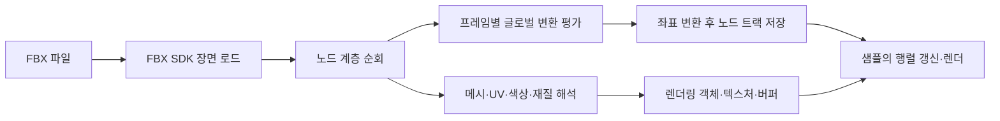

# 과제 03 · 외부 모델을 렌더링 객체로 변환하기

[← 개요](../README.md)

## 문제

FBX 파일은 메시뿐 아니라 노드 계층, 재질, 정점 속성, 애니메이션 데이터를 담습니다. 파일을 읽는 것에서 끝나지 않고 프로젝트의 좌표계와 렌더링 객체로 변환해야 화면에 사용할 수 있습니다.

## 설계 선택

FBX SDK로 장면을 읽은 뒤 노드를 재귀 순회합니다. 전체 노드 목록과 메시를 가진 객체 목록을 구분하고, 로컬 변환과 노드 관계를 보관합니다. 메시의 UV·색상·재질 정보를 해석해 렌더링용 정점과 텍스처 연결에 사용합니다.

## 좌표와 정점 속성의 해석

FBX의 행렬을 프로젝트 행렬로 변환하고 축 배치를 바꾸는 경로를 둡니다. 메시의 기하 변환과 법선 변환도 구분합니다. UV는 제어점 기준인지 폴리곤 정점 기준인지, 직접 배열인지 인덱스를 거치는지에 따라 읽는 경로가 달라집니다.

재질의 diffuse 텍스처 참조에서 파일명을 가져오는 처리가 있습니다. 파일 확장자와 위치에 대한 샘플의 규칙을 사용하므로 임의의 FBX 재질을 그대로 재현하는 범용 재질 임포터로 볼 수는 없습니다.

## 애니메이션의 확인 범위

첫 애니메이션 스택의 구간을 30fps 기준으로 순회하며 각 노드의 글로벌 변환을 평가해 트랙으로 저장합니다. 샘플은 시간에 따라 프레임을 고르고 노드 변환 행렬을 렌더링에 전달합니다.

설명 대상은 **노드 변환 애니메이션**입니다. 본 가중치 스키닝, 여러 애니메이션 블렌딩, 상태 머신까지 완성했다고 주장하지 않습니다. 샘플 재생에는 0~50 프레임 구간을 왕복하는 제한도 있습니다.

## 한계와 검증 관점

애니메이션이 없는 파일, 다른 길이·시작 프레임의 트랙, 누락된 텍스처, 좌표축·단위가 다른 모델, 여러 UV와 재질 매핑을 검증해야 합니다. 로더가 데이터를 읽는 경로와 모든 입력 형식을 안전하게 지원하는 것은 별개의 문제입니다.
